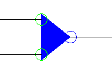
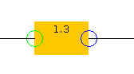
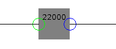
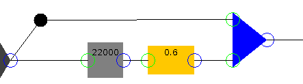

# A short word about signal processing

For those who aren't familiar with this kind of stuff (if it is actually the case, then it is very unlikely that you got here by chance), I'll try here to give some explaination about what this program is made for and actually does.

First, I let you know that the initial project statement is availible [here](http://www.run.montefiore.ulg.ac.be/~grailet/docs/INFO0062/2019-2020/project_statement.pdf). The ressources are just on the [parent page](http://www.run.montefiore.ulg.ac.be/~grailet/INFO0062_proj_19-20.php).

# Signal processing

A signal is, in our case, a sequence of real numbers, that will be considered as the values of something evoluting over time. In real life, as time is continuous, there are an infinite number of values on any time span ! Here, we say that this is discrete, we will consider the time as increasing by small steps.

Very often, the signal that will be processed (in our case) will be a sound. Actually, this program is not able to take as input other files that `.wav` and `.csv` files (`csv` files are files containing all the values on two channels separated by commas).

We may (you may not, actually, but I am) be interested in processing this signal in order to get another signal, conveying another information, or in another form.

To do so, we will have to carry operations on that signals. Assuming a signal `a` ranging from time `0` to time `T`, represented by the sequences of numbers `a(0), a(1), ..., a(T)` , we can build:
- A scaled version `b` of `a` by a constant number `g`: `b(0) = g\*a(0), b(1) = g\*a(1), ..., b(T) = g\*a(T)`
- A shifted version `b` of `a` by `n` samples: `b(0) = 0, b(1) = 0, ..., b(n) = b(0), b(n+1) = b(1), ..., b(T) = b(T-n)`
- The sum of `a` and `b` (represented, as for `a`, by the sequence `b(0), b(1), ..., b(T)`) `c`: `c(0) = a(0) + b(0), c(1) = a(1) + b(1), ..., c(T) = a(T) + b(T)`.

Here are the three main operations availible to "play" with signals.

The whole point of this program is to provide a tool to compute signal that way: e.g., in a very simple case, to compute the sum of two signals.

# Block diagram

As you may expect, there is a representation for all of these things. These are called block diagrams.

A signal is carried by a wire, and operation on this signal is done by blocks that represent some basic or more advanced computation on that signal. Here is how the addition of two signal looks like:

    

On the right, we have the two wires that carry the inputs signals (in our previous example, `a` and `b`), and the output signal is carried by the left wire.

Then, here are a gain filter (left) and delay filter (right):

    
    

The fun part begins when we begin to make some more interesting combination of these. For example, you can add to a signal a shifted and scaled version of himself, you can see the result here after:

    

Can you predict what will be outputted ? In this case, the output will be the original signal with a slight simple echo: we add to the original signal the same signal but 22000 samples later and at 0.6 times its original loudness. Note that the most commonly used frequency sampling is 44100 Hz. This means that, every seconds of sounds, we take 44100 samples of sound.